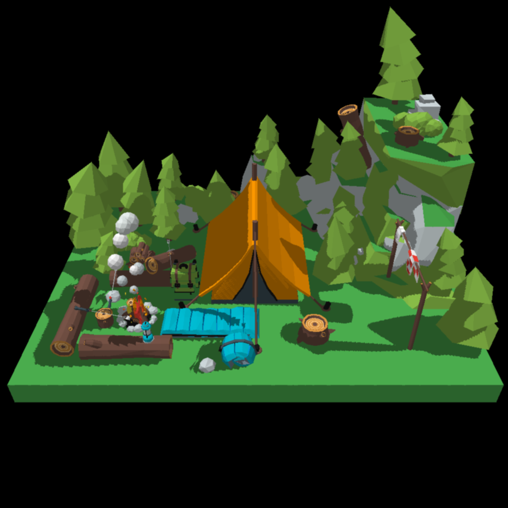

# Raytracer

- Monte Carlo based Global Illumination with explicit light sampling
- Diffuse scattering
- Caustics
- Glossy Reflections
- Bounding Volume Hierarchy
- Multi Sample Anti Aliasing
- OpenMP CPU Parallelization
- Object and Material Loader

# Rasteriser

- Object and Material Loading
- Textures
- Gouraud Shading
- Barycentric coordinates
- 4D Clipping
- Directional Lighting
- Shadow Mapping with soft shadows
- OpenMP CPU Parallelization

